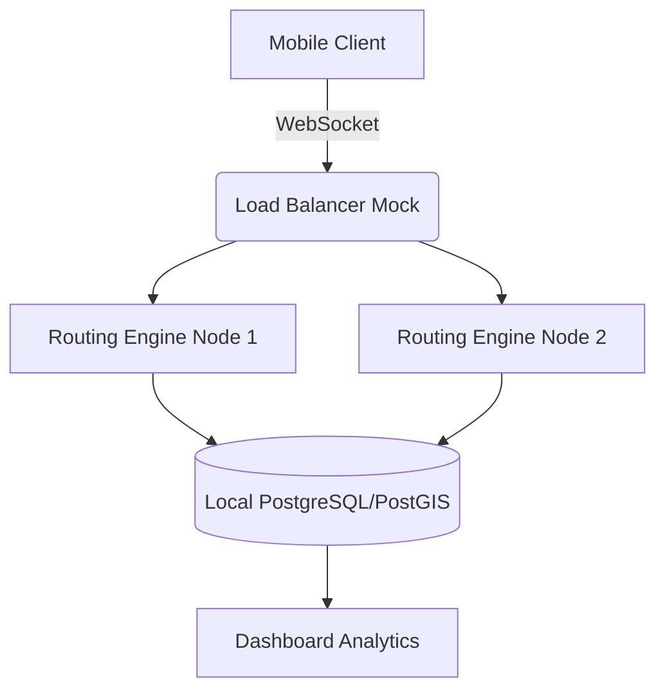

# BayouRide: Local Infrastructure Routing

**TechForge Industrial**
_Louisiana Tech Corridor High-Concurrency Router_

## Overview
BayouRide is a localized logistics and routing simulation engine tailored for the Louisiana Tech Corridor. It demonstrates how to handle high-concurrency requests and real-time location streaming without massive cloud overhead, proving enterprise-grade reliability locally.

## Architecture

## Hardware Agnostic Logic
Built to run efficiently on limited-resource environments, BayouRide uses manual polling fallbacks if WebSocket connections drop, ensuring consistent operation even in degraded network conditions typical of edge environments.
